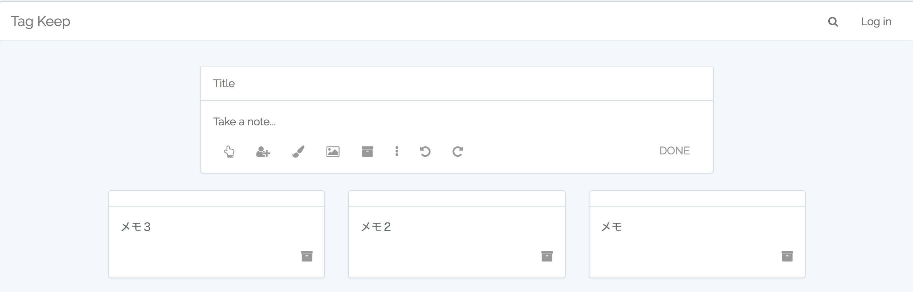

# tag-keep

## 環境
```
macOS Sierra: 10.12.6
Docker for Mac: 17.09.0-ce
npm: 4.0.5

Laradock: 4.*
Laravel: 5.5.19
PHP: 7.1.11
composer: 1.5.2
MySQL: 8.0
nginx: 1.13.6
```

## 環境構築手順
```
$ git clone https://github.com/mom0tomo/tag-keep.git
```

### Docker(laradock)
```
$ cd tag-keep/laradock

$ cp env-example .env

$ docker-compose up -d nginx mysql
$ $docker-compose ps

         Name                        Command               State                     Ports
------------------------------------------------------------------------------------------------------------
laradock_applications_1   /true                            Exit 0
laradock_mysql_1          docker-entrypoint.sh mysql ...   Up       0.0.0.0:3306->3306/tcp
laradock_nginx_1          nginx                            Up       0.0.0.0:443->443/tcp, 0.0.0.0:80->80/tcp
laradock_php-fpm_1        docker-php-entrypoint php-fpm    Up       9000/tcp
laradock_workspace_1      /sbin/my_init                    Up       0.0.0.0:2222->22/tcp
```

### application(tag-keep)
```
$ cd ../tag-keep
$ cp .env.example .env

$ npm install

$ npm run watch
```

#### Open another terminal window.
```
$ docker exec -it laradock_mysql_1 /bin/bash

$ mysql -u root -p

mysql > CREATE DATABASE app;
```

#### Open another terminal window.
```
$ docker exec -it laradock_workspace_1 /bin/bash

$ composer install
$ php artisan key:generate
$ php artisan migrate
$ php artisan db:seed
```

### Visit:
<a href="http://localhost">localhost</a>.

<p align="center"></p>

## TODO & Unfinished
```
1. 未完成
メモのTitleを保存する機能
ログイン機能
検索機能
追加/削除したメモをリアルタイムに更新する機能
(現状はブラウザをリロードしないと反映できません)

2. 未着手
アイコンで表示されている機能
(リマインダーを追加、共同編集者を追加、背景の色を変更、画像アップロード、元に戻す/やり直し、メモを固定、メモを選択、リストアイテム作成、手書き入力）
入力フォームをクリックした時にフォームが伸長する機能
ホバー時のアイコン/ツールチップの表示
```
